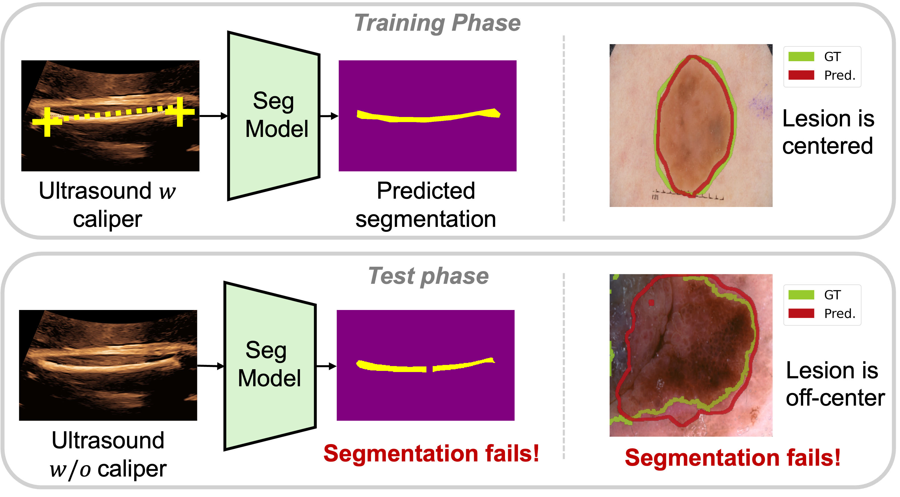

# Shortcut Learning in Skin Lesion Segmentation




Public pytorch implementation for our paper [Shortcut Learning in Medical Image Segmentation](https://arxiv.org/abs/2403.06748). This code repository contains Case B part of the paper, where we investigated the shortcut learning in skin lesion segmentation caused by zero-padded convolutions and center cropped training sets. 

If you find this code helpful in your research, please cite the following paper:

```
@article{lin2024shortcut,
  title={Shortcut Learning in Medical Image Segmentation},
  author={Lin, Manxi and Weng, Nina and Mikolaj, Kamil and Bashir, Zahra and Svendsen, Morten Bo S{\o}ndergaard and Tolsgaard, Martin and Christensen, Anders Nymark and Feragen, Aasa},
  journal={arXiv preprint arXiv:2403.06748},
  year={2024}
}
```

*This paper is accepted at MICCAI 2024, Morocco (the 27th International Conference on Medical Image Computing and Computer Assisted Intervention).*

## Virtual Environment Setup
The code is implemented in Python 3.9 using the Pytorch library. We only tested the code with Pytorch 3.9. One way of getting all the requirements is by using virtualenv and the requirements.txt file.

`pip install -r requirements.txt`

## Running the Code

### 0. Preparation
#### 0.a Add `./global_config.py` under this repo folder:

```
import sys
if PATH_OF_YOUR_REPO not in sys.path:
    sys.path.append(PATH_OF_YOUR_REPO)


REPO_PATH = PATH_OF_YOUR_REPO
DATASET_PATH = PATH_OF_DATASET
```
#### 0.b Download the datsets and unzip them under `DATASET_PATH` above
Datsets used in this work: [Here](#data)

#### 0.c Prepare the `csv` files for later training
Run `python3 ./prepare_data/main.py`. The csv files that will be used later, will be saved under `./datafiles/`.

### 1. Train segmentation model on centralized and off-center training sets

Training:   
Run `python3 ./train/train_seg.py`
Change the config variable `isCrop` in `train_config.py` for trainning with cropped images.

Inference:
Run `python3 ./train/inference_seg.py`. 
Change the configuration in `inference_config.py`.


### 2. Analysing the results

#### 2.a Results in Figure 4
Run `python3 ./analysis/metrics_by_rings.py`.
Results are saved at `./records/analysis/metrics_by_rings/`.
Change `version_num` to the one you want to test on.

#### 2.b Results in Figure 7 (Supplementary material)
Run `python3 ./analysis/moving_patch.py`.
Results are saved at `./records/analysis/moving_patch/`.
Change `version_num` to the one you want to test on.

## Code Structure

* `/analysis/` contains codes for analysis the effect of shortcut learning.
* `/datafiles/` contains csv files used for training.
* `/figures/` contains figures used for README file.
* `/models/` contains codes for segmentation models.
* `/prepare_data/` contains codes for creating csv files. 
* `/records/` contains running results.
* `/train/` contains codes for training and inference. 

## Data
The datasets used in this work are all public and can be downloaded from:
* [ISIC 2017](https://challenge.isic-archive.com/data/#2017)


## Contact
Please use the issue tracking tool to report bugs or email directly to [ninwe@dtu.dk](ninwe@dtu.dk). If you have further questions regarding the paper, please feel free to email [ninwe@dtu.dk](ninwe@dtu.dk) as well.


